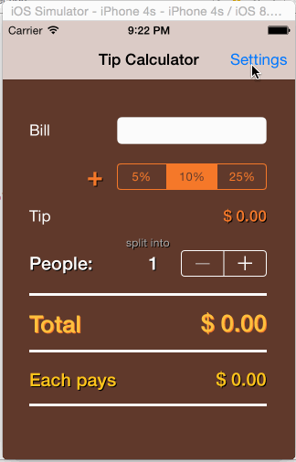

# Tip Calculator Demo

(README for my CodePath assignment submission)

This is an iOS application for helping calculate total amount due with tip, and also split it amongst everyone in the group. This allows preserving preferences of tip percentages for best, worst and normal service received. It also allows rounding down the total amount (especially useful if not splitting the bill)

Time spent: 26 hours spent in total

Completed user stories:

 * [x] Required: User can enter bill amount and will see total amount due based on a pre-populated tip percentage choice.
 * [x] Required: User can enter bill amount and choose a tip percentage (from pre-populated options) and see the total amount due.
 * [x] Optional: User can customize the pre-populated tip percentages, and also the percentage that's selected by default on a fresh launch of the app.
 * [x] Optional: User can optional request the total amount to be rounded to the lower dollar amount, and persist that option across app sessions.
 * [x] Optional: User can split the total amount due (inclusive of tip) into multiple people and see the amount due for each person.
 
Notes:

Researched available tip calculator application on different app stores (play store and iTunes app store) to see commonly supported options. Went with the set that doesn't clutter the UI a lot and covers the essentials, providing an intuitive easy to use interface.

Walkthrough of all user stories:

GIF created with [LiceCap](http://www.cockos.com/licecap/).
